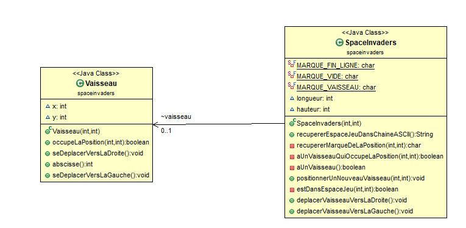
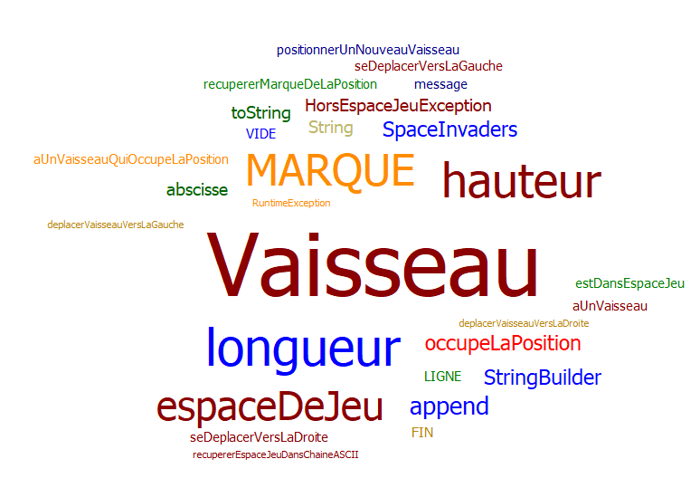

#spaceinvaders
projet de M2104

##Semaine N°2 du 10/05/2021 au 16/05/2021

Fonctionnalité n°1 : Déplacer un vaisseau dans l'espace de Jeu

#### Storie 1 : cree un espace de jeu
      - pouvoir voir l'espace de jeu
      - le delimité pars des point fixe

#### Storie 2 : positionner un vaiseau 

      - voir le vaisseau en forme de V
      - possitionné le vaiseau 

#### Storie 3 :
Le vaisseau se déplace d'un pas vers la droite
Si le vaisseau se trouve sur la bordure droite de l'espace de jeu, le vaisseau doit rester immobile (aucun déplacement, aucune exception levée : le vaisseau reste juste à sa position actuelle).

#### Storie 4 :

Le vaisseau se déplace d'un pas vers la gauche
Si le vaisseau se trouve sur la bordure gauche de l'espace de jeu, le vaisseau doit rester immobile (aucun déplacement, aucune exception levée : le vaisseau reste juste à sa position actuelle).

## Diagrame de classe :

## Nuage de mots :

